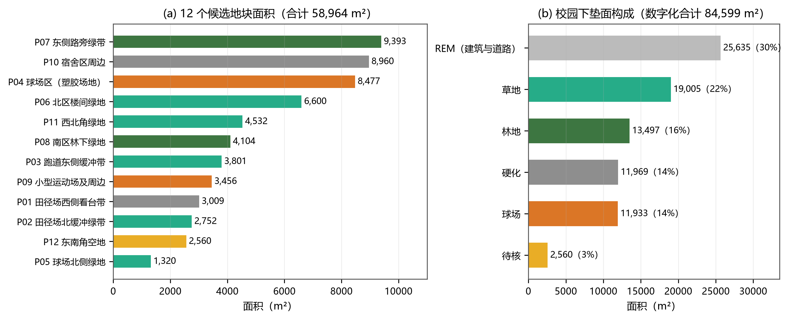
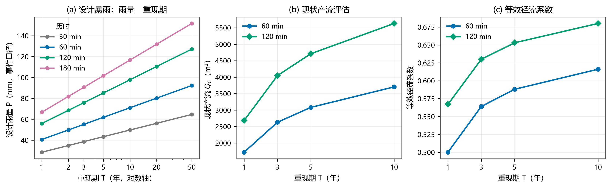
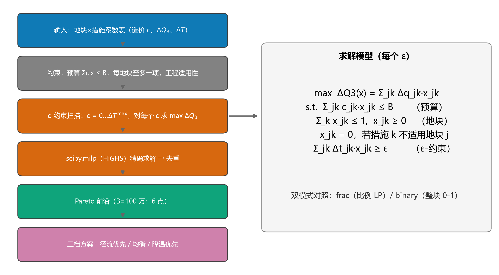
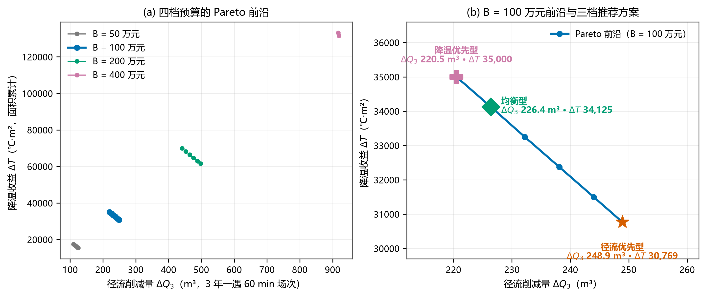
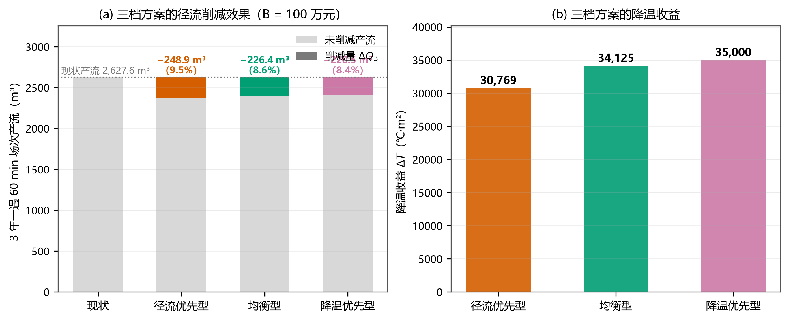
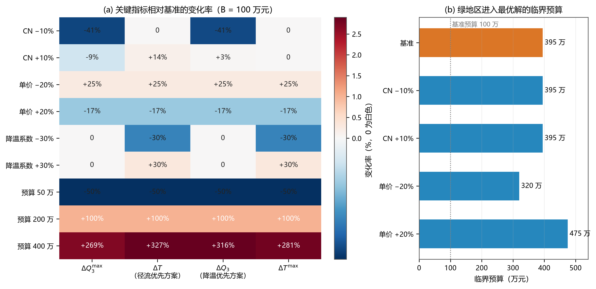
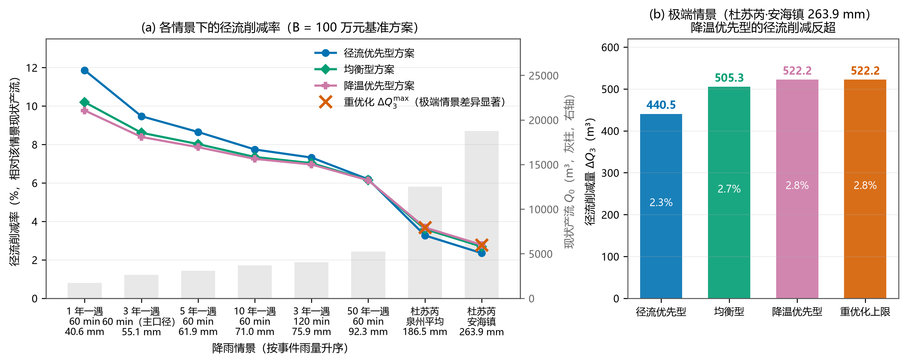
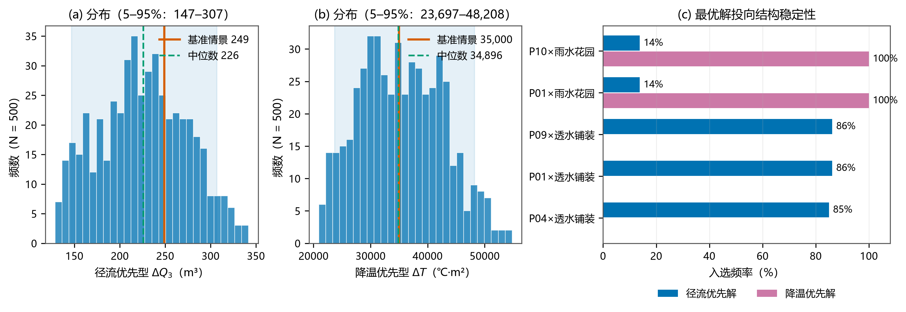

# 台风暴雨与高温双风险下校园绿色基础设施配置优化

## ——基于 SCS-CN 与双目标 0-1 规划的"绿-雨"双服务方案设计

> 全国青少年科学探究建模能力大赛 ｜ H4 主题四"产业与城市绿色转型" ｜ 福建赛区 ｜ 高中组 ｜ 3 人团队
> 说明：全文图表沿用项目统一编号 T1–T12，与 `06-论文/figures/图注清单.md` 一致。

---

## 摘要

福建省沿海地区同时面临台风暴雨与夏季高温的双重风险。校园中的硬化场地与绿地既是暴雨径流的策源地，也是高温热暴露的主要空间；在有限预算下，绿色基础设施"放在哪、做成什么"才能同时服务于径流控制与热环境改善，是一个典型的多目标决策问题。本文以晋江市季延中学本部（数字化占地约 8.46 万 m²）为案例，将校园划分为 12 个候选改造地块，构建"绿-雨"双服务优化模型链：用当地暴雨强度公式生成设计暴雨（M1）；用 SCS-CN 模型计算现状与改造后产流（M2）；以文献系数建立降温响应模型（M3）；建立以预算与工程适用性为约束、以径流削减量 ΔQ 与降温收益 ΔT 最大为目标的双目标 0-1 规划模型（M4），用 ε-约束法结合 scipy.milp（HiGHS 求解器）精确求解，并以"面积比例"（连续规划）与"整块实施"（0-1 规划）双模式对照。主要结果：校园 3 年一遇 60 min 场次现状产流 **Q₀ = 2 627.6 m³**（等效径流系数 0.564）；在基准预算 100 万元下，Pareto 前沿的径流削减量介于 **220.5–248.9 m³**（削减率 8.4%–9.5%）、降温收益介于 **3.08–3.50 万 ℃·m²**；对应"径流优先 / 均衡 / 降温优先"三档可执行方案；同等预算下面积比例模式比整块实施模式多削减约 **11%**。敏感性分析显示 ΔQ 对 CN 最敏感（CN −10% 时 −41.2%），比例模式下单价缩放与预算缩放等价（齐次性）；结构敏感性分析给出绿地区进入最优解的**临界预算 ≈395 万元**（随单价近似线性）；极端台风"杜苏芮"情景（日雨量 263.9 mm）下，雨水花园的单位径流效率反超透水铺装（5.2 对 4.4 m³/万元），**双目标由"权衡"转为"共向"**。Monte Carlo 稳健性检验（N=500）表明最优解的首选地块与投向结构高度稳定（P01 作为首选地块的出现频率 86.2%）。模型与方法参数化封装为软件工具，可推广到其他校园、社区与工业园区。

**关键词**：绿色基础设施；SCS-CN 模型；双目标 0-1 规划；ε-约束法；海绵城市；校园雨洪管理

---

## 1 问题提出

### 1.1 现实背景

福建沿海是台风登陆与暴雨频次最高的区域之一。2023 年 7 月 28 日，台风"杜苏芮"在晋江沿海登陆（登陆强度 15 级、50 m/s），晋江安海镇录得 263.9 mm 的极端日雨量，泉州全市平均 186.5 mm，南安日雨量 338.9 mm 破历史纪录（中国天气网，2023）[4]。与此同时，同期的夏季高温使校园地表面温度显著升高，硬化场地（操场、球场、道路）成为热暴露的主要空间。

在"海绵城市"与城市绿色转型的政策背景下，校园作为高密度硬化、高脆弱人群（青少年）集中、管理决策链短的典型场景，是绿色基础设施（Green Infrastructure, GI）改造的理想试验田：一方面，暴雨径流削减与热环境改善是学校后勤部门真实面对的诉求；另一方面，校园尺度小、边界清晰，恰好适合用一个"小而完整"的数学模型来回答真实的资源配置问题。

### 1.2 案例对象与研究区

案例学校为**晋江市季延中学本部**（罗山街道山仔南区 150 号），校园内包含 400 m 标准田径场、球场带、教学楼群与宿舍区。基于公开卫星影像数字化，校园轮廓内合计约 **84 599 m²**（学校公开简介约 101 795.7 m²，含周边，数字化面积用于模型，精度说明见 §3 假设 A7）。

按"下垫面类型 × 管理单元"原则，将校园划分为 **12 个候选改造地块（P01–P12，合计 58 964 m²）** 与"其余区域（REM，建筑与道路为主，25 635 m²）"，地块编号与影像底图见图 T1，面积与下垫面构成见图 T4。

### 1.3 问题重述

学校后勤部门面临三个具体问题：

1. **现状风险有多大？** —— 在不同重现期的设计暴雨下，校园现状产流（径流总量）与等效径流系数是多少？
2. **钱花在哪最值？** —— 在候选地块中，把绿地改造为雨水花园、下沉式绿地，或把硬化区改造为透水铺装，哪些投放的单位投资效益最高？
3. **不同预算下分别给什么方案？** —— 给定预算 B（50–400 万元区间），如何给出"径流削减优先 / 均衡 / 降温优先"三档可执行方案，并说明其代价与收益？

### 1.4 任务分解

围绕上述三问，工作分解为六阶段：现实问题 → 问题数学化 → 模型链 M1–M3 → 配置优化 M4 → 检验 M5 → 决策输出（图 T2）。

---

## 2 模型假设

模型假设及其合理性说明、违反假设的潜在影响如下（对应"假设合理"素养要求）：

- **A1 降雨空间均匀假设**：校园尺度（约 500 m × 540 m）内，设计暴雨的降雨强度空间均匀。合理性：对流性降水的空间相关尺度一般为数公里，校园远小于该尺度；影响：产流量估计的偶然误差，已通过情景分析（§7.3）与 CN 敏感性（§7.1）覆盖。
- **A2 SCS-CN 适用性假设**：事件尺度降雨—径流关系可用 SCS-CN 曲线数法描述，且校园下垫面可归入水文土壤组 C。合理性：SCS-CN 是国内外城市雨洪评估的常用工程方法，所需的 CN 取值有标准表可查（TR-55）[2]；影响：CN 的取值不确定性以 ±10% 敏感性覆盖，并如实报告其非对称影响（§7.1）。
- **A3 措施效果地块可加假设**：各候选地块的改造效果相互独立、可直接按面积线性叠加。合理性：决策以"地块"为最小单元，地块间无上下游串流建模需求；影响：忽略汇流叠加与邻近效应，结果偏保守。
- **A4 降温响应取稳态经验系数假设**：降温收益采用文献报道的地表/近地温度降幅系数（不做现场实测，项目口径为"纯论文"）。合理性：系数来自国内同气候区（华东）文献[5][6]，量级与季节一致；影响：以 ±30% 敏感性覆盖（§7.1）。
- **A5 造价静态假设**：三类措施的单价取公开定额的保守中值，不考虑通胀、施工条件差异与地区差价。合理性：《海绵城市建设技术指南》附录 3 给出单价区间[1]，取区间中低值并做 ±20% 敏感性；影响：预算的"购买力"平移，已量化（§7.1）。
- **A6 地下管网不建模假设**：校园既有排水管网未纳入模型，模型只衡量可改造地表产生的径流削减量，不计算管道排水能力。合理性：管网资料非公开可得，且本次决策对象是地表 GI 配置；影响：模型的削减量不能直接换算为"积水消除量"，已在局限（§7.6）中声明。
- **A7 面积数字化精度假设**：地块面积由公开卫星影像数字化获得，估计误差 ±5–10%（无实地测量）。合理性：决策排序主要取决于单位面积效益（与绝对面积近似无关）；影响：绝对削减量随之成比例变化，不影响方案结构与排序结论。

---

## 3 符号说明

| 符号 | 含义 | 单位 | 取值来源 |
|---|---|---|---|
| j ∈ J | 候选地块编号（P01–P12） | — | 影像数字化（T1） |
| k ∈ K | 措施类型：保持现状 / 雨水花园 / 下沉式绿地 / 透水铺装 | — | 《指南》设施类型[1] |
| x_jk | 决策变量：地块 j 实施措施 k 的面积比例（比例模式）或 0-1（整块模式） | — | 本文定义 |
| A_j | 地块 j 面积 | m² | 影像数字化 |
| c_jk | 措施 k 在地块 j 的全额造价 | 元 | 单价 × A_j（单价见 §5.1） |
| Δq_jk | 措施 k 在地块 j 的径流削减量（主情景：3 年一遇 60 min） | m³ | M2 计算 |
| Δt_jk | 措施 k 在地块 j 的降温收益（按面积累计） | ℃·m² | M3 计算 |
| B | 改造预算 | 元（报告用万元） | 情景参数 |
| T | 重现期 | 年 | 1, 3, 5, 10, 50 |
| P_T | 设计雨量（事件口径） | mm | M1 计算 |
| CN | 径流曲线数（curve number） | — | TR-55（水文组 C）[2] |
| S | 潜在滞蓄量 S = 25400/CN − 254 | mm | SCS-CN |
| Q | 产流深 | mm | SCS-CN |
| Q₀ | 现状产流总量 | m³ | M2 计算 |
| η | 径流削减率 η = ΔQ / Q₀ | % | 本文定义 |
| ε | ε-约束法的降温收益下界 | ℃·m² | 算法参数 |

---

## 4 问题分析

### 4.1 现实情境的数学转化

三个现实问题（§1.3）分别对应三类数学对象：

| 现实问题 | 数学对象 | 模型 |
|---|---|---|
| ① 现状风险多大 | 给定重现期 P_T 下的现状产流 Q₀(P_T) 与等效径流系数 | M1 + M2 |
| ② 钱花哪最值 | 单位投资效益（m³/万元、℃·m²/万元）的排序 | M2 + M3（单地块系数） |
| ③ 不同预算给什么方案 | 参数化（以 B 为参数）的双目标优化问题及其 Pareto 前沿 | M4 |

### 4.2 双服务的量化定义

- **径流控制服务**：以主设计情景（3 年一遇、60 min 设计暴雨）下的**径流削减量 ΔQ（m³）** 度量；等价指标为产流削减率 η = ΔQ/Q₀。
- **热环境改善服务**：以**降温收益 ΔT（℃·m²）** 度量，即各改造地块的降温强度（℃/m²，文献系数）按面积累计，反映"降温服务总量"。
- 双目标彼此耦合于同一预算约束：在有限资金下，两类措施的投放存在竞争，构成真正的多目标权衡。

### 4.3 优化问题形式化

$$\max_x \ \Delta Q(x) = \sum_{j \in J}\sum_{k \in K} \Delta q_{jk}\, x_{jk}, \qquad \max_x \ \Delta T(x) = \sum_{j \in J}\sum_{k \in K} \Delta t_{jk}\, x_{jk}$$

$$\text{s.t.} \quad \sum_{j,k} c_{jk}\, x_{jk} \le B \quad \text{（预算约束）}$$

$$\sum_{k} x_{jk} \le 1,\ \forall j \quad \text{（每地块至多一种措施；整块模式下为 } = 1 \text{）}$$

$$x_{jk} = 0 \ \text{（若措施 } k \text{ 不适用地块 } j \text{，见工程适用性约束）}, \qquad x_{jk} \in [0,1]\ \text{或}\ \{0,1\}$$

**工程适用性约束**依据《海绵城市建设技术指南》的设施适用条件[1]给出：硬化/看台带 → {保持现状, 透水铺装, 雨水花园}；球场/塑胶场地 → {保持现状, 透水铺装}；草地 → {保持现状, 下沉式绿地, 雨水花园}；林地 → {保持现状, 下沉式绿地}；性质待核地块 → {保持现状, 透水铺装}。

### 4.4 数据与参数的可获得性

本项目为"纯论文"口径：**全部参数与数据来自公开资料检索并逐条记录来源**，不作实地测量。参数体系与来源如下：

| 参数 | 取值 | 来源 |
|---|---|---|
| 暴雨强度公式 | q = 1470.505(1+0.750·lgP)/(t+10.257)^0.604 [L/(s·ha)] | 泉州（含晋江）公式（公开资料整理）[3] |
| 极端事件雨量 | 安海镇 263.9 mm / 泉州平均 186.5 mm（2023 杜苏芮） | 中国天气网[4] |
| CN（现状） | 草地 74、林地 70、不透水（硬化/球场）98、待核 86、建筑道路 95 | TR-55 水文组 C[2] |
| CN（改造等效） | 雨水花园 66、下沉式绿地 68、透水铺装 80 | 由《指南》径流系数区间折算[1] |
| 措施单价 | 透水铺装 130 元/m²（60–200）、下沉式绿地 45 元/m²（40–50）、雨水花园 200 元/m²（150–800，取简易低段） | 《指南》附录 3[1] |
| 降温系数 | 雨水花园 7、下沉式绿地 6、透水铺装 4 ℃/m²（现状基准：草地 −6、林地 −9） | 北大 2017[5]、中国园林 2022[6] |

---

## 5 模型建立

### 5.1 M1 设计暴雨模型

采用泉州（含晋江）暴雨强度公式（理论频率曲线形式）：

$$q = \frac{1470.505\,(1 + 0.750 \lg P)}{(t + 10.257)^{0.604}} \quad [\mathrm{L/(s \cdot ha)}]$$

采用**事件雨量口径**将强度换算为历时 t 的累计雨量：$P_{mm} = q \times 60t / 10000$（1 ha = 10⁴ m²）。取重现期 T ∈ {1, 2, 3, 5, 10, 20, 50} 年、历时 {30, 60, 120, 180} min 生成设计暴雨表（图 T6a）。主设计情景取 **3 年一遇、60 min**，对应事件雨量 **55.1 mm**；其余情景用于 §7.3 的情景分析。

> 说明：该公式的来源为公开资料整理转述，原始批文出处仍在核实（线索指向《晋江市中心城区排水（雨水）防涝综合规划》）；公式参数已在软件中参数化，如后续核实有出入可一键替换重算。此为诚实报告项，不影响方法结构。

### 5.2 M2 产流模型（SCS-CN）

采用 SCS 曲线数法计算各下垫面的产流深：

$$S = \frac{25400}{CN} - 254, \qquad Q = \begin{cases} 0, & P \le 0.2S \\ \dfrac{(P - 0.2S)^2}{P + 0.8S}, & P > 0.2S \end{cases}$$

地块 j 的现状产流体积 $Q_{0,j} = Q_{mm}(P_T, CN_j)\cdot A_j / 1000$（m³），校园现状产流 $Q_0 = \sum_j Q_{0,j}$（含 REM）。改造措施通过降低 CN 实现产流削减：$\Delta q_{jk} = [Q_{mm}(P_T, CN_j) - Q_{mm}(P_T, CN_k^{new})] \cdot A_j / 1000$。

CN 取值依据 TR-55 水文土壤组 C（福建红壤偏 C 组）[2]；措施等效 CN 由《指南》径流系数区间在 3 年一遇雨量下折算[1]。SCS-CN 的一个重要特性是**初损阈值效应**：低 CN 面（如雨水花园 CN 66）在高雨量下仍有较大滞蓄空间，该特性在 §7.3 极端情景分析中产生了关键结论。

### 5.3 M3 降温响应模型

降温收益按"稳态经验系数 × 面积"累计：

$$\Delta t_{jk} = \max\left(0,\ \delta_k + \delta_j^{base}\right) \cdot A_j \quad [\mathrm{℃ \cdot m^2}]$$

其中 δ_k 为措施降温系数（雨水花园 7、下沉式绿地 6、透水铺装 4 ℃/m²），δ_j^base 为现状下垫面基准温度指数（硬化/球场 0、草地 −6、林地 −9 ℃/m²，用于扣除"现状已较凉爽"的部分，体现"升级收益"）。系数取自国内同气候区文献：[5] 报告沥青与草地地表的显著温差，[6] 报告遮阴地表温度可低 3.3–18.8 ℃、植草砖比沥青低 2.6 ℃。全部系数按 ±30% 做敏感性（§7.1）。

### 5.4 M4 配置优化模型（核心）

**决策变量**：x_jk（比例模式 ∈[0,1]；整块模式 ∈{0,1}）。
**目标**：max ΔQ 与 max ΔT（§4.3）。
**约束**：预算、每地块至多一项、工程适用性（§4.3）。

**双模式设计**（方法学创新点）：真实工程既可能"整块实施"（0-1 规划），也可能"按面积比例分期实施"（连续规划），本文对两种模式分别求解并对照，用来量化"整块实施的粗粝度损失"。

**求解方法**：ε-约束法将双目标问题转化为一系列单目标 0-1 规划：对 ε 从 0 到 ΔT_max 等距扫描，求解 max ΔQ s.t. ΔT(x) ≥ ε（连续模式即线性规划 LP，整块模式即混合整数规划 MILP），去重后得到 Pareto 前沿。使用 scipy.milp（底层 HiGHS 求解器）**精确求解**（非启发式），保证前沿的正确性。求解流程与优化模型见图 T3。

**解的唯一性处理**：由于同类地块（如同为 CN 98→80 的透水铺装）的单位效益严格相等，问题存在"等价最优解族"（简并）。为使报告口径唯一、可复现，在目标函数中叠加一个极小量级的字典序权重（λ = 1e-4，按地块编号优先），该处理不改变目标值（仅影响 10⁻⁴ m³ 量级以下的取舍），整块模式下不产生任何影响。

### 5.5 指标体系

1. **削减率** η = ΔQ/Q₀（%）；2. **单位投资效益** ΔQ/造价（m³/万元）与 ΔT/造价（℃·m²/万元）；3. **双目标权衡结构**：Pareto 前沿的形状与端点；4. **结构稳健性**：临界预算、Monte Carlo 中的方案结构频率。

---

## 6 模型求解与结果

### 6.1 参数标定与单地块系数

以主设计情景（3 年一遇 60 min，P = 55.1 mm）计算 12 个地块 × 4 类措施的系数表（造价、ΔQ₃、ΔT），在**工程可行集内**计算单位投资效益（表 1，完整表见附录 B）。

**表 1 可行措施内的单位投资径流效益（m³/万元，3 年一遇 60 min）**

| 地块 | 现状类型 | 最优可行措施 | 单位效益 | 优先等级 |
|---|---|---|---|---|
| P01 田径场西侧看台带 | 硬化 | 透水铺装 | 2.49 | A |
| P04 球场区 | 球场 | 透水铺装 | 2.49 | A |
| P09 小型运动场及周边 | 球场 | 透水铺装 | 2.49 | A |
| P10 宿舍区周边 | 硬化 | 透水铺装 | 2.49 | A |
| P02/P03/P05/P06/P11 绿地区 | 草地 | 下沉式绿地 | ≈1.00 | B |
| P12 东南角空地 | 待核 | 透水铺装 | 0.61 | B |
| P07/P08 林地区 | 林地 | 下沉式绿地 | 0.30 | C |

（注：硬化区若实施下沉式绿地的表观效益更高（9.53），但该组合工程不可行，不参与优化；论文口径只在可行集内比较，详见 §7.5。）

### 6.2 现状评估（回答第 ① 问）

3 年一遇 60 min 场次下，校园现状产流 **Q₀ = 2 627.6 m³**，等效径流系数 0.564；其余情景见表 2（图 T6b、T6c）。

**表 2 现状产流评估（60/120 min）**

| 重现期 | 雨量 (60 min) | Q₀ (60 min) | 径流系数 | 雨量 (120 min) | Q₀ (120 min) | 径流系数 |
|---|---|---|---|---|---|---|
| 1 年 | 40.6 mm | 1 716.6 m³ | 0.500 | 55.9 mm | 2 680.1 m³ | 0.567 |
| 3 年 | 55.1 mm | **2 627.6 m³** | 0.564 | 75.9 mm | 4 045.8 m³ | 0.630 |
| 5 年 | 61.9 mm | 3 079.3 m³ | 0.588 | 85.2 mm | 4 709.4 m³ | 0.653 |
| 10 年 | 71.0 mm | 3 702.6 m³ | 0.616 | 97.8 mm | 5 630.1 m³ | 0.680 |

### 6.3 Pareto 前沿与三档方案（回答第 ③ 问）

在基准预算 **B = 100 万元**下，比例模式求得的 Pareto 前沿包含 6 个非支配点：**ΔQ₃ ∈ [220.5, 248.9] m³，ΔT ∈ [3.08, 3.50] 万 ℃·m²**（图 T7b）。三个代表性方案（三档）为：

**表 3 三档方案（B = 100 万元，比例模式）**

| 方案 | 造价 | ΔQ₃ | ΔT | 主要投向 |
|---|---|---|---|---|
| 径流优先型 | 100 万元 | **248.9 m³**（η = 9.5%） | 30 769 ℃·m² | P01 透水铺装（整块）+ P09 透水铺装（整块）+ P04 部分 |
| 均衡型 | 100 万元 | 226.4 m³（η = 8.6%） | 34 125 ℃·m² | P01 雨水花园（整块）+ P09 部分 + P10 雨水花园（局部） |
| 降温优先型 | 100 万元 | 220.5 m³（η = 8.4%） | **35 000 ℃·m²** | P01 雨水花园（整块）+ P10 雨水花园（局部） |

不同预算下（50/100/200/400 万元），前沿整体近似等比外移（图 T7a）：预算翻倍，削减量与降温收益近似翻倍，说明在校园的"可行域"内，模型对预算近似线性响应，不存在饱和拐点（直至 400 万元）。

### 6.4 优先改造地图（回答第 ② 问）

按"可行措施内最高单位投资效益"分级：**A 级优先区**（P01、P04、P09、P10，硬化/球场区，2.49 m³/万元）、**B 级后备区**（P02/P03/P05/P06/P11/P12，≈0.61–1.00）、**C 级远期区**（P07/P08 林地，0.30），见图 T9。三档方案的投向与"优先改造地图"高度一致：预算的绝大部分应投向 A 级区。

各方案的削减效果与现状的对比见图 T8：三档方案在 3 年一遇场次下分别削减现状产流的 9.5%、8.6%、8.4%。

### 6.5 双模式对照（方法学结果）

整块实施模式（0-1）在 B = 100 万元下的削减上限为 **222 m³**（Pareto 前沿仅 2 点，ΔT 区间 2.59–3.13 万 ℃·m²），比比例模式低 **≈11%**（图 T7a、附录 C）。这一差异量化了"整块实施"的粗粝度损失，提示真实工程中"分块分期 + 局部实施"具有确定性的效率收益。

---

## 7 结果分析与检验

### 7.1 敏感性分析

对四类参数做单因素扰动（B = 100 万元，比例模式），结果见图 T10a：

| 扰动 | ΔQ₃ᵐᵃˣ 变化 | ΔTᵐᵃˣ 变化 | 说明 |
|---|---|---|---|
| CN −10% | **−41.2%** | 0 | 见下（非对称） |
| CN +10% | −9.0% | 0 | 硬化 CN 98 触顶 100 + 初损阈值效应 |
| 单价 ±20% | +25.0% / −16.7% | 同比例 | 比例模式下与预算缩放**等价**（齐次性） |
| 降温系数 ±30% | 0 | ±30.0% | 两目标在参数层面近似解耦 |
| 预算 50 / 200 / 400 万 | −50% / +100% / +269% | −50% / +100% / +281% | 预算弹性 |

两个重要发现：① ΔQ 对 CN 的敏感性**非对称**（−10% 影响远大于 +10%），原因是硬化区现状 CN 98 已逼近上限 100（+10% 被截断），且 SCS-CN 的初损阈值效应使低雨量端的变化更显著；两个方向都表现为"削减量下降"，属**保守特性**。② 比例模式下"单价缩放 ⇔ 预算缩放"的齐次性意味着：只要措施可行集不变，价格波动与预算调整对配置结构的影响等价——这为工程采购谈判提供了直接依据。

### 7.2 结构敏感性：临界预算

定义"绿地区（草地/林地）首次进入 ΔQ 最优解（面积占比 >0.1%）"的最小预算为**临界预算**，扫描结果（步长 5 万元）：基准情形 **≈395 万元**；单价 −20% 时降至 320 万元，单价 +20% 时升至 475 万元（与单价近似线性）；对 CN 与降温系数**不敏感**（图 T10b）。这一结构性结论说明：在 100 万元量级的预算下，绿地区（下沉式绿地等）进入"径流最优解"是不经济的，优先改造必须聚焦硬化区。

### 7.3 情景分析

对 8 个降雨情景（1/3/5/10/50 年一遇 60 min、3 年一遇 120 min、杜苏芮极端两档）分别做"固定方案评估"与"重新优化"（图 T11）：

- **设计暴雨范围内（1–50 年）**：最优配置结构保持不变（透水铺装优先），基准方案在各情景下维持 6.2%–11.9% 的削减率，随雨量增大削减率单调下降。
- **极端情景（杜苏芮）**：安海镇 263.9 mm 情景下现状产流高达 18 781 m³，基准方案削减率降至 2.4%（440.5 m³），而**重优化上限为 522.2 m³（2.8%）**；更值得注意的是，此时"降温优先型"的径流削减反超"径流优先型"（522.2 对 440.5 m³）——**因为大雨量下雨水花园（CN 66）的单位削减效率（5.2 m³/万元）反超透水铺装（4.4 m³/万元）**。**双目标从"权衡"转为"共向"**，这是本模型发现的最有价值的结构性结论：如果学校以防台防汛为首要目标，应优先建设雨水花园类滞蓄设施，而非单纯透水化。

### 7.4 Monte Carlo 稳健性检验

对 CN（±10%）、单价（±20%）、降温系数（±30%）三参数联合均匀抽样（N = 500，固定随机种子），每次重新求解 Pareto 前沿与三档方案（图 T12）：

- ΔQ₃ᵐᵃˣ 中位数 225.9 m³（5–95% 分位 147.0–306.8，变异系数 0.214）；ΔTᵐᵃˣ 中位数 34 896 ℃·m²（5–95% 分位 23 697–48 208）；
- **方案结构高度稳健**：P01 作为首选地块的出现频率 86.2%（其余 13.8% 的样本中首选 P01 雨水花园）；ΔQ 最优解中硬化区（P01/P04/P09）透水铺装占比 85–86%；**绿地区进入最优解 0/500**——与临界预算 395 万元的结论自洽；
- 在参数不利组合下，ΔQ₃ᵐᵃˣ ≥ 基准值 90% 的样本占 51.4%，≥ 基准值本身的样本占 31.2%（ΔT 对应 49.6%）；最大值的四分位区间为 191.1–260.5 m³——提示"100 万元方案的削减量"存在约 ±20% 的量级不确定性，决策时应按中位偏保守预期。

### 7.5 一致性核对与对照检验

1. **参数区间一致性**：CN（70–98）、措施 CN（66–80）、单价、降温系数均取自公开文献区间，模型取值位于区间内；敏感性扫描覆盖全区间，主要结论（硬化优先、三档结构）在区间内不变。
2. **效率口径核对**：单位效益只在"工程可行=Y"的组合内比较（硬化区下沉式绿地的 9.53 m³/万元为不可行假设值，仅作参照）。
3. **量级合理性核对（解析复算）**：100 万元预算可完成透水铺装约 100 万 ÷ 130 元/m² ≈ 7 700 m²（约合校园面积的 9%）；按单地块系数独立复算，其对应削减量 ≈ 32.4 mm（CN 98→80 的产流深差） × 7 700 m² ≈ 249 m³，与模型输出的 248.9 m³ 一致——线性叠加口径自洽性得到验证。
4. **双模式互验**：连续（LP）与 0-1（MILP）两种独立模型的 Pareto 端点相差 11%，方向与量级一致，互为验证。

### 7.6 误差来源与局限

- **管网未建模**（A6）：削减量≠积水消除量，实际排水能力还取决于管网与地形。
- **成本静态**（A5）：未计施工条件与后期维护成本（雨水花园维护成本相对较高）。
- **降温系数为文献经验值**（A4）：未做现场实测，只反映"量级与排序"，不代表特定地块的实测温差。
- **面积数字化误差 ±5–10%**（A7）：影响绝对量，不影响排序与结构结论。
- **事件口径**：设计暴雨未采用雨型（时程分配），削减量对雨型敏感的部分未展开。

---

## 8 模型评价与推广

### 8.1 优点

1. **完整的问题链条**：从本地暴雨公式、SCS-CN 产流、文献降温响应到双目标精确优化、敏感性/情景/稳健性三重检验，全链条可复现（代码包 + 数据表）。
2. **精确求解与结构洞察**：用 MILP 精确解而非启发式搜索；产出的是"结构（投向、排序、临界预算）"而不只是"一个数字"。
3. **双模式对照与简并处理**：量化整块实施的效率损失（11%），并以字典序权重解决等价解族的口径问题。
4. **诚实处理不确定性**：敏感性覆盖全部关键参数区间，极端情景与 Monte Carlo 揭示"双目标共向"等非平凡结论。

### 8.2 缺点

- 未含管网与地形（汇流路径），措施间相互作用被线性近似；
- 造价与降温系数为静态经验值；
- 情景未做雨型（如芝加哥雨型）细化。

### 8.3 推广

模型完全参数化：**替换地块划分、CN、单价与暴雨公式即可迁移**到其他校园、社区、工业园区或城市片区。软件工具（"校园绿-雨配置优化器"）支持一键重算，适合作为海绵城市前期决策的快速评估工具；本文方法对沿海城市"台风+高温"双风险场景具有普适性。

### 8.4 建议（面向学校的应用要点，详见附录 D）

1. **优先改造 A 级区**：P01 看台带、P04 球场周边、P09 运动场、P10 宿舍周边（透水铺装，单位效益最高）。
2. **按预算选档**：≤100 万元 → 径流优先型（P01+P09 整块透水）；追求显示度与舒适度 → 降温优先型（P01 雨水花园）。
3. **防台视角**：若以防台防汛为首要目标，建议将部分透水铺装替换为雨水花园（极端雨量下效率反超），并保留溢流通道。
4. **分期实施**：不建议"整块一次做完"，按面积比例分期可提升效率约 11%。

---

## 9 结论

本文针对福建沿海校园"台风暴雨 + 高温"双风险下绿色基础设施的配置问题，建立了"设计暴雨—产流—降温—双目标优化—三重检验"的完整模型链，并以晋江市季延中学为案例得到了可执行的量化结论：现状产流 Q₀ = 2 627.6 m³（3 年一遇 60 min）；基准预算 100 万元对应的最优前沿为 ΔQ ∈ [220.5, 248.9] m³、ΔT ∈ [3.08, 3.50] 万 ℃·m²；优先改造区为硬化/球场区（P01/P04/P09/P10）；绿地区进入最优解的临界预算 ≈395 万元；极端台风情景下"雨水花园"的径流效率反超透水铺装，双目标由权衡转为共向；Monte Carlo 检验证实方案结构稳健（首选地块频率 86.2%）。模型与方法可直接复用与推广。

---

## 10 参考文献

[1] 住房和城乡建设部. 海绵城市建设技术指南——低影响开发雨水系统构建（试行）[S]. 北京, 2014.（附录 3 单价表、表 4-3 径流系数、设施适用条件）https://img6.ccement.com/2015/07/20/a9ebe6eb.pdf
[2] USDA Soil Conservation Service. SCS National Engineering Handbook, Section 4: Hydrology [S]. 1972；CN 表转引自 USACE HEC 文档（TR-55 CN Tables）. https://www.hec.usace.army.mil/confluence/hmsdocs/hmstrm/cn-tables
[3] 泉州（含晋江）暴雨强度公式（公开资料整理转述；线索指向《晋江市中心城区排水（雨水）防涝综合规划》（2021 年批复），**原始出处待核实**，公式已参数化）.
[4] 中国天气网. 局地超 500 毫米！台风"杜苏芮"致福建多地降雨量破纪录 [EB/OL]. 2023-07-30. http://news.weather.com.cn/2023/07/3640232.shtml
[5] 北京大学学报（自然科学版）. 6 种城市下垫面热环境效应对比研究 [J]. 2017, 53(5): 881-889. https://xbna.pku.edu.cn/article/2017/0479-8023/0479-8023-53-5-881.shtml
[6] 中国园林. 缓解城市热岛效应的硬质景观设计方法研究综述 [J]. 2022, 38(8): 71-78. http://lalavision.com/cn/article/pdf/preview/10.14085/j.fjyl.2022.08.0071.08.pdf
[7] Microsoft Bing Maps. 卫星影像（工作底图，影像时间未知；定位与数字化过程见项目《底图说明》）.
[8] SciPy Developers. SciPy 1.18（scipy.optimize.milp，HiGHS 求解器）[CP/OL]. https://scipy.org

---

## 附录

### 附录 A 代码与复现

| 模块 | 文件 | 功能 |
|---|---|---|
| M1 | `05-模型/m1_design_storm.py` | 设计暴雨表（P_T） |
| M2 | `m2_scs_cn.py` / `m2_run_baseline.py` | SCS-CN 产流与现状评估 |
| M3+M4 系数 | `m5_common.py`（单一数据源）/ `m4_build_options.py` | 参数化措施系数与报表 |
| M4 | `m4_optimize.py` | ε-约束 + scipy.milp 双目标求解（双模式） |
| M5 | `m5_sensitivity.py` / `m5_scenario.py` / `m5_montecarlo.py` | 敏感性/情景/稳健性 |
| 图件 | `06-论文/make_figures.py` | 全部图件（矢量 PDF + 300 dpi PNG） |

复现：`C:\Python314\python.exe`（Python 3.14，numpy/scipy/matplotlib）；按 m1 → m2 → m4 → m5 顺序执行即可全量重算。

### 附录 B 数据表（摘要）

- 设计暴雨表（P_T）：`输出/P_T_表.csv`（含 T5 情景值）；地块参数表：`输入/地块参数表.csv`。
- 措施选项表（12 地块 × 4 措施，含"工程可行"列与单位效益）：`输出/措施选项表.csv`。

### 附录 C 详细计算结果

- Pareto 前沿（比例/整块 × 四档预算 8 张表）：`输出/pareto_frac_B*.csv`、`pareto_binary_B*.csv`；三档方案：`输出/三档方案_B100.csv`。
- 敏感性：`m5_sens_indicators.csv`、`m5_sens_green_budget.csv`；情景：`m5_scen_table.csv`；Monte Carlo：`m5_mc_samples.csv`（500 行）、`m5_mc_summary.csv`、`m5_mc_parcels.csv`。

### 附录 D 改造建议（要点）

1. 一期（≤100 万元，径流优先）：P01 看台带 + P09 运动场整块透水铺装，P04 球场区局部透水；预期削减 3 年一遇场次产流约 249 m³（9.5%）。
2. 二期（至 200–400 万元）：P10 宿舍区透水化，随后按临界预算结论（≈395 万元）启动绿地区下沉式绿地改造。
3. 舒适度导向调整：若以活动区热舒适为优先，可将 P01 由透水铺装改为雨水花园（同一预算下 ΔT 由 30 769 提升至 35 000 ℃·m²，+14%），代价是径流削减量减少约 28 m³。
4. 防台加固：极端台风预警期前，确保雨水花园溢流与校园排水通道畅通；新建滞蓄设施应布设在低洼汇水处（待补充高程数据后细化）。

---

*（初稿 v1 完；待补：论文格式规范排版、图表统一编号核对、泉州公式出处核实后回填 [3]。）*
