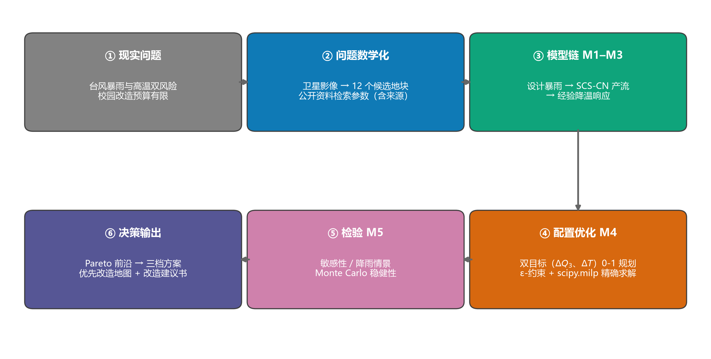
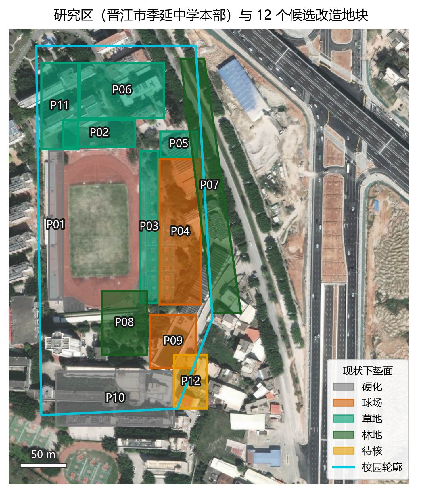
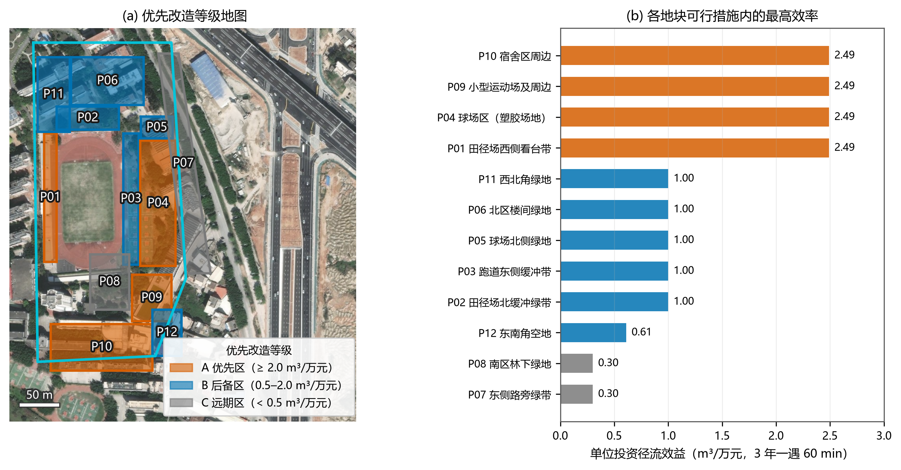

# 项目报告

## 校园"绿-雨"双服务配置优化
### ——台风暴雨与高温双风险下，有限预算的绿色基础设施决策

> 全国青少年科学探究建模能力大赛 ｜ H4 主题四"产业与城市绿色转型" ｜ 福建赛区 ｜ 高中组 ｜ 3 人团队
> 案例学校：晋江市季延中学本部 ｜ 类型：数学建模 + 软件模型（纯论文口径）

---

## 1 项目概况

| 项目要素 | 内容 |
|---|---|
| 项目名称 | 校园"绿-雨"双服务配置优化——台风暴雨与高温双风险下的绿色基础设施决策 |
| 案例对象 | 晋江市季延中学本部（罗山街道山仔南区 150 号，含 400 m 田径场，数字化面积 84,599 m²） |
| 核心问题 | 在有限预算下，绿地与透水设施"**放在哪、做成什么**"，使暴雨径流削减与夏季降温两项收益最大化？ |
| 交付物（五件） | 研究报告（论文）、项目报告、科学日志、软件模型（"校园绿-雨配置优化器"）、展示视频 |
| 项目周期 | D1（2026-09-24）启动，按 3 周日程推进（D21 = 2026-10-14，官方截止日后统一平移） |

**一句话成果**：为案例校园产出了一套可直接使用的改造决策工具——输入预算，输出"径流优先 / 均衡 / 降温优先"三档方案（精确到地块），并发现了"极端台风情景下双目标由权衡转为共向"等结构性结论。

---

## 2 选题背景与意义

1. **真实的双风险**。福建沿海是全国台风与暴雨频次最高的区域之一。2023 年 7 月 28 日台风"杜苏芮"在晋江沿海登陆（15 级），晋江安海镇录得 263.9 mm 极端日雨量，泉州全市平均 186.5 mm（中国天气网）。与此同时，夏季高温让操场、球场等硬化场地成为校园热暴露的主要空间。
2. **政策与趋势**。海绵城市建设与"城市绿色转型"是 H4 主题的核心；校园是天然的"微缩城市"，具备完整的硬化—绿地—水系结构。
3. **为什么选校园**：① 存在真实决策者（学校后勤）与真实资金约束；② 边界清晰、面积适中，模型可以做"小而完整"；③ 青少年是高脆弱人群，"防暴雨、降高温"具有直接的社会价值；④ 项目成果存在被学校实际采纳的可能（对应"成果转化"）。

由此提炼出后勤部门的三问：**① 现状风险多大？② 钱花在哪最值？③ 不同预算下分别给什么方案？**

---

## 3 研究目标与总体设计

**目标**：建立从"降雨/下垫面"到"预算配置决策"的完整模型链，用精确求解给出可执行方案，并用多重检验保证结论稳健。

**总体设计**（图 T2 技术路线）：现实问题 → 问题数学化 → 模型链 M1–M3 → 配置优化 M4 → 检验 M5 → 决策输出。

**方法定位**：双目标 0-1 规划（ε-约束法 + scipy.milp 精确求解）+ SCS-CN 产流 + 文献降温系数；软件模型承载"可运行、可复现、可迁移"。

---

## 4 实施过程与关键决策

### 4.1 数据策略：纯论文口径下的"全溯源"

受赛制口径约束，本项目**不制作实物、不做实地测量**；全部数据来自公开资料检索或公开影像，并逐条记录来源（见科学日志与《参数来源说明》）。该策略带来两个直接要求：① 参数必须来自可引用来源（标准、文献、公开文件）；② 不确定性必须显式处理（第 4.4 节）。

### 4.2 场地数字化：从卫星影像到 12 个地块

用公开卫星影像（Bing 工作底图，另以高德、Esri 三源交叉定位）数字化校园轮廓与下垫面，形成 **12 个候选改造地块（P01–P12，合计 58,964 m²）** 与"其余区域 REM（建筑与道路，25,635 m²）"。面积精度约 ±5–10%，已在论文假设 A7 中声明。地块划分遵循"下垫面类型 × 管理单元"原则，并获得团队一致确认（图 T1）。

### 4.3 模型链建立（M1–M4）

| 模型 | 关键决策 | 理由 |
|---|---|---|
| M1 设计暴雨 | 采用泉州（含晋江）暴雨强度公式；事件雨量口径 P = q·60t/10⁴；主情景 3 年一遇 60 min | 当地公式最具地域代表性；事件口径与 SCS-CN 匹配 |
| M2 产流 | SCS-CN 曲线数法；CN 取 TR-55 水文土壤组 C（草地 74 / 林地 70 / 硬化 98） | 国际通用工程方法，参数有标准表可查 |
| M3 降温 | 文献系数按面积累计（雨水花园 7 / 下沉式 6 / 透水 4 ℃·m⁻²），扣除现状基准温度 | 与"改造升级收益"语义一致；不做实测的合规替代 |
| M4 优化 | 双目标 0-1 规划：max ΔQ、max ΔT；预算 + 每地块一项 + 工程适用性约束；ε-约束扫描求 Pareto | 精确求解（非启发式），保证前沿正确性 |

**双模式设计**：同时求解"面积比例实施"（连续规划）与"整块实施"（0-1 规划）两种真实工程模式，用于量化"整块实施"的效率损失。

### 4.4 检验体系（M5）：让结论可靠

- **敏感性**：CN ±10%、单价 ±20%、降温系数 ±30%、预算四档——覆盖全部关键参数区间；
- **结构敏感性**：提出"绿地区进入最优解的临界预算"指标（≈395 万元），并测其随参数的迁移规律（与单价近似线性）；
- **情景分析**：1–50 年重现期、120 min 历时、台风"杜苏芮"极端两档；
- **Monte Carlo**：三参数联合抽样 N = 500，检验方案结构与首选地块的稳定性。

### 4.5 困难与解决（真实过程记录）

| 困难 | 影响 | 解决方式 |
|---|---|---|
| 赛制口径变更（实物模型 → 软件模型） | 原方案需重构 | 48 小时内重排方案 v0.2：工程模型由"配置优化器"软件承担，五件材料映射重构 |
| 无法实测（温度、地块边界） | 参数与面积存在不确定性 | 影像数字化 + 公开资料双轨；不确定性全部纳入三重检验并如实声明 |
| 暴雨公式原始出处暂未核实 | 来源链不完整 | 公式参数全部参数化可一键替换；论文与日志中如实标注"待核实"（诚信处理） |
| **等价最优解族（简并）** | 同类地块效率严格相等，报告口径不唯一（同一预算出现多个等价方案） | 在目标中叠加极小字典序权重（λ=1e-4，编号优先），使输出唯一且可复现 |
| **数值口径分裂** | 发现"历史输出表（1 位小数）"与"全精度计算"导致两套脚本选出不同代表解 | 将所有脚本统一为**单一数据源**（系数由同一函数生成），报表仅作展示 |
| 地图着色可辨性差 | 影像底图上色块难辨 | 提高填充不透明度 + 纯色描边，并逐张目检修正 |
| 环境限制（SSL 拦截、GBK 控制台、字体缺字） | 下载与输出中断 | 下载脚本使用不校验证书上下文；程序统一 UTF-8 输出；图表改 mathtext 数学符号 |

> 说明：上述"简并"与"口径分裂"两个问题是团队在自查中**主动发现并修复**的，过程完整记录于《建模日志》与《科学日志》——我们把它视为本项目的诚信与工程素养体现。

---

## 5 主要结果

1. **现状评估**：3 年一遇 60 min 场次校园现状产流 **Q₀ = 2,627.6 m³**（等效径流系数 0.564）；50 年一遇 60 min 达 5,225.5 m³。
2. **基准预算（100 万元）三档方案**（图 T7）：

| 方案 | ΔQ₃ | ΔT | 主要投向 |
|---|---|---|---|
| 径流优先型 | **248.9 m³**（9.5%） | 30,769 ℃·m² | P01、P09 整块透水铺装 + P04 局部 |
| 均衡型 | 226.4 m³（8.6%） | 34,125 ℃·m² | P01 雨水花园 + P09 部分 + P10 局部 |
| 降温优先型 | 220.5 m³（8.4%） | **35,000 ℃·m²** | P01、P10 雨水花园 |

3. **优先改造地图**（图 T9）：硬化/球场区（P01/P04/P09/P10）为 A 级优先区（2.49 m³/万元，约为绿地区下沉式的 2.5 倍）。
4. **结构结论**：① 绿地区进入最优解的临界预算 ≈395 万元；② 同预算下整块实施比面积比例实施少削减 **约 11%**；③ 极端台风情景（263.9 mm）下**雨水花园的径流效率反超透水铺装**，双目标由"权衡"转为"**共向**"（防台视角的直接建议：优先建设雨水花园类滞蓄设施）。
5. **稳健性**（图 T12）：N=500 抽样下方案结构稳定，首选地块 P01 出现频率 86.2%；绿地区进入最优解 0/500（与临界预算自洽）。

---

## 6 创新点

1. **"绿-雨"双服务耦合优化**：把"暴雨径流削减"与"夏季降温"放进同一个多目标模型，多数同类校园项目只做单一目标；
2. **精确求解 + 完整前沿**：用 MILP（HiGHS）精确求解而非启发式，给出可验证的 Pareto 前沿与三档方案；
3. **双模式对照**：量化"整块实施 vs 面积比例实施"的效率损失（11%），直接回答了工程落地方式问题；
4. **结构洞察**：提出"临界预算"与"双目标共向"两个可迁移的结构性结论；
5. **可运行、可迁移的软件模型**：一键重算；替换两个数据文件即可迁移到其他学校/社区；
6. **诚实的不确定性处理**：三重检验 + 局限声明 + 两处自查问题的公开记录。

---

## 7 成果与交付物

| 交付物 | 内容 | 状态 |
|---|---|---|
| 研究报告（论文 v1） | 十节结构：摘要→问题→假设→符号→分析→建模→求解→检验→评价→附录；图件 T1–T12 | 初稿完成 |
| 项目报告 | 本文件 | 初稿完成 |
| 科学日志 | D1 起逐日记录（过程、失败与修改、来源记录、用时） | 持续更新 |
| 软件模型 | "校园绿-雨配置优化器"：代码包 + 使用说明 + 录屏脚本（zip） | 包已生成 |
| 展示视频 | 3–4 分钟：场景→问题→数据→模型→方案→软件演示 | 待制作 |

**给学校的建议（要点）**：一期（≤100 万元）优先 P01/P09 整块透水铺装、P04 局部；二期扩展 P10 并按临界预算启动绿地区改造；若以热舒适为优先，可将 P01 改为雨水花园（ΔT +14%，ΔQ −28 m³）；防台期确保滞蓄设施溢流通道畅通。

---

## 8 团队分工与协作

| 角色 | 成员 | 主责 |
|---|---|---|
| 甲 · 数据与核对 | （实名待填） | 影像数字化、地块核对、数据整理、图表复核 |
| 乙 · 建模与计算 | （实名待填） | 参数检索、模型实现（M1–M5）、软件模型、图件 |
| 丙 · 统筹与转化 | （实名待填） | 资料归档、日志管理、论文与报告统稿、视频 |

**协作机制**：

1. **日志即写即存**：每完成一步当日记录（含失败与修改），日志是论文素材与评审材料的共同底稿；
2. **双人复核**：数据与口径问题（如单位效益、临界预算）由建模组提出、数据组独立复算；
3. **版本与规范**：文件命名（数据/图/代码）、目录分区（00–08）、临时文件用后即删；
4. **口径统一**：所有交付材料引用同一套结果文件（单一数据源），避免版本分叉。

**协作中的关键事件**：① 赛制变更后全员 48 小时内完成方案重构；② 自查发现"数值口径分裂"并联合修复（第 4.5 节）；③ 图件迭代中由核对人逐张目检提出问题清单（标注重叠、颜色可辨性等）。

---

## 9 推广价值

1. **方法可迁移**：模型完全参数化——替换地块数据与当地暴雨公式即可用于其他学校、社区、工业园区；
2. **情景通用**：沿海城市普遍面临"台风暴雨 + 高温"双风险，本项目的"双服务"框架与"双目标共向"结论具有普适参考价值；
3. **工具化**：软件模型面向非专业用户（后勤决策者），命令行一键运行，输出中文报告与 CSV 表；
4. **决策支持**：优先改造地图、临界预算、三档方案可直接进入预算讨论。

---

## 10 反思与展望

**局限**：地下管网与地形未入模；造价与降温系数为静态经验值；面积为影像数字化近似；设计暴雨未采用雨型。

**改进方向**：① 引入管网与高程数据，将"削减量"推进到"积水风险"；② 若条件允许，用低成本温度记录进行小规模实测校准文献系数；③ 增加雨型（如芝加哥雨型）情景；④ 推动校方采纳并跟踪改造效果。

**团队收获**：我们第一次完整经历了"真实问题 → 数学建模 → 精确求解 → 软件工具 → 多重检验 → 决策建议"的闭环；更重要的是学会了**与自己较真**——简并解、口径分裂、参数出处的核验，都是在交付前一遍遍自查中发现的。这些比任何一个具体数字都更让我们确信：建模的价值在于**让决策有据可依**。

---

## 附录：里程碑时间线

| 节点 | 内容 |
|---|---|
| D1–D2 | 方案重构（适配新口径）；场地定位与地块划分初稿；预算与单价口径 |
| D3 | 参数检索（含来源）；M2 现状评估；M4 双模式优化初版 |
| D10–D12 | M5 三重检验（敏感性 / 情景 / Monte Carlo）；口径修复 |
| D13 | 图件 T1–T12（矢量 + 300 dpi）；图注清单 |
| D14–D16 | 论文初稿 v1；软件模型包 |
| D17 | 项目报告（本文件）；全文校核 |
| D18–D21 | 展示视频；科学日志汇总；答辩演练与终检 |

*（项目报告 v1 完；实名、日期与最终数据以提交版为准。）*
